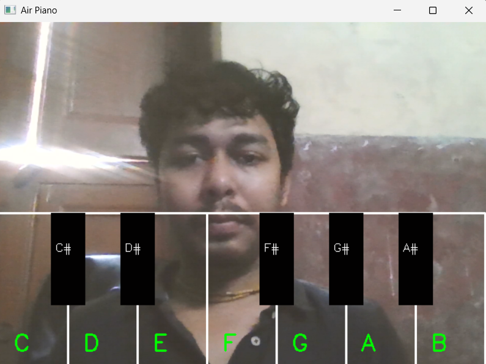
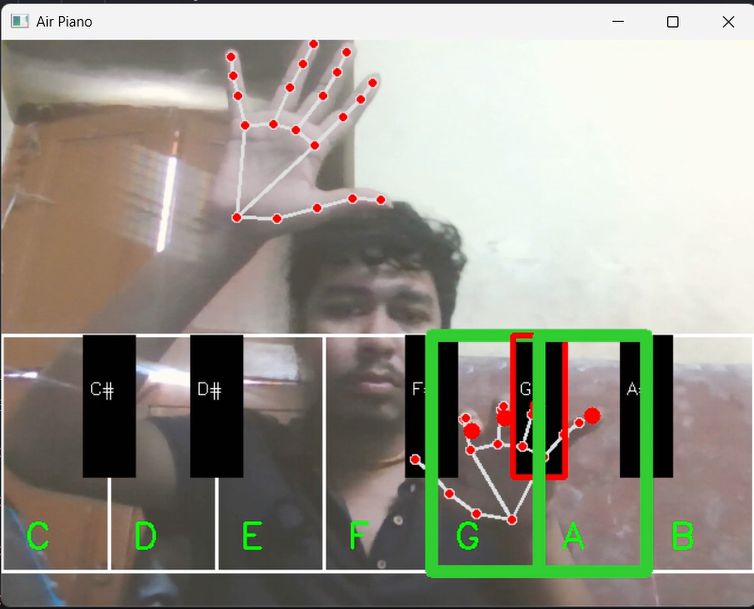
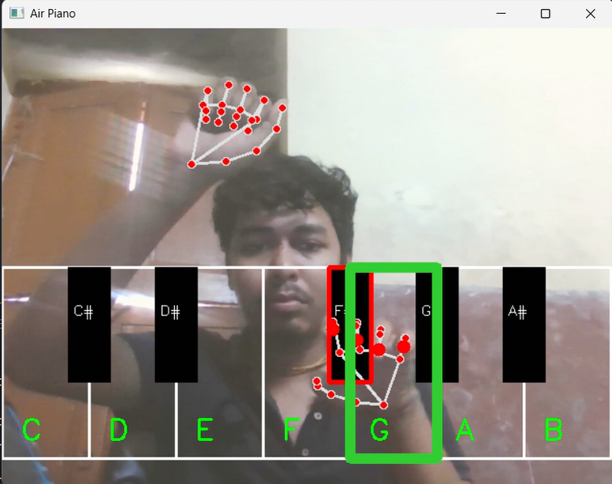

# 🎹 Air Piano

Air Piano is a computer vision-based virtual musical instrument built with Python, OpenCV, MediaPipe, and Pygame. It allows users to play piano notes in the air using hand gestures captured by a webcam.

## ✨ Features

- 🎹 Virtual Piano Keys (White & Black Keys)
- ✋ Real-time Hand Tracking using MediaPipe
- 👆 Finger Tap Detection
- 🎼 Multi-Finger Chord Playing
- 🎨 Key Highlighting on Press
- 🥁 Multiple Sound Packs (Piano & Drum)
- 🤚 Gesture-Based Instrument Switching
- 📷 Webcam-Controlled Interaction
- ⚡ Real-Time Audio Playback

## 🛠️ Technologies Used

- Python
- OpenCV
- MediaPipe
- Pygame
- NumPy

## 🚀 How It Works

1. The webcam captures hand movements.
2. MediaPipe detects hand landmarks in real time.
3. Fingertip positions are mapped to virtual piano keys.
4. A note is played when a finger taps a key region.
5. Different sound packs can be selected using hand gestures.
6. Multiple fingers can be used simultaneously to play chords.

## 📂 Project Structure

```text
AirPiano/
│
├── app.py
├── piano-mp3/
│   ├── piano sounds
│   └── drum sounds
├── Assets/
├── README.md
└── requirements.txt
```

## ▶️ Installation

Clone the repository:

```bash
git clone <your-repository-url>
cd AirPiano
```

Install dependencies:

```bash
pip install -r requirements.txt
```

Run the application:

```bash
python app.py
```

## 🎯 Future Improvements

- MIDI Output Support
- Recording & Playback
- Additional Instruments
- Velocity-Sensitive Notes
- Virtual Sustain Pedal
- Octave Switching
- Custom Sound Packs

## 📸 Demo

- Normal


- Piano


- Dram


## 🤝 Contributing

Contributions, ideas, and improvements are welcome.

## 📜 License

This project is open source and available under the MIT License.